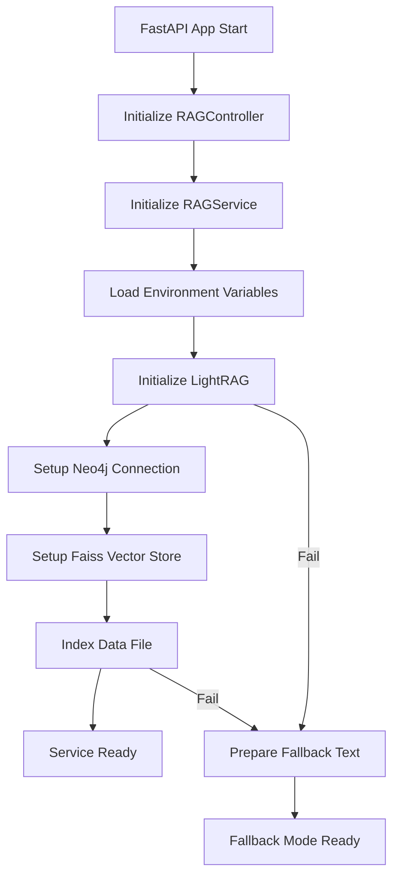
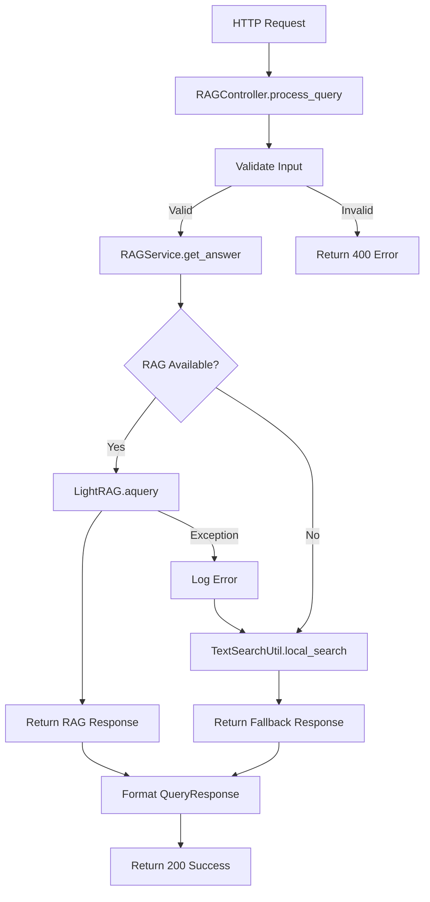
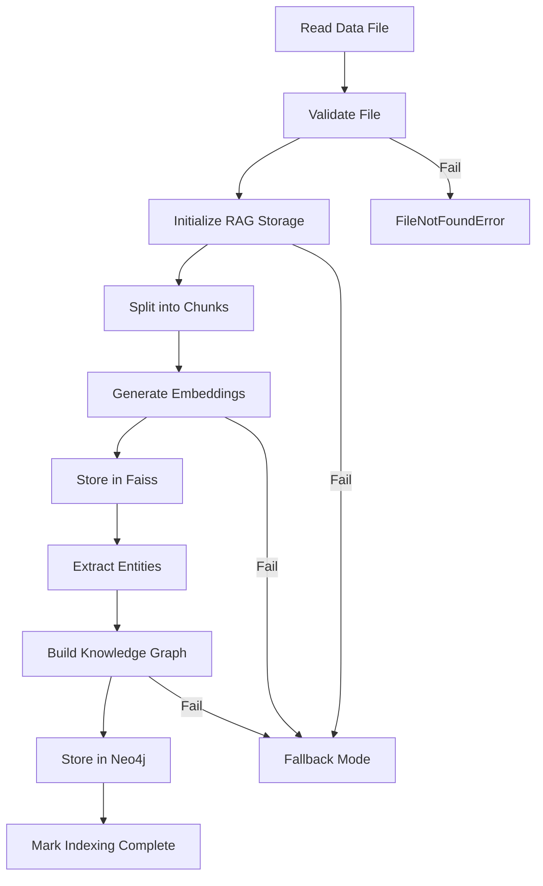

# 🏗️ LightRAG System Architecture Documentation

<div align="center">

**Tài liệu kiến trúc hệ thống LightRAG**  
*Hướng dẫn chi tiết về cấu trúc, thiết kế và triển khai*

[](https://github.com/HelloMinh2122005/light-rag)
[](#mvc-architecture)
[](#ngôn-ngữ)

</div>

---

## 📋 Mục lục

1. [Tổng quan kiến trúc](#-tổng-quan-kiến-trúc)
2. [Mô hình MVC](#-mô-hình-mvc)
3. [Chi tiết từng layer](#-chi-tiết-từng-layer)
4. [Data Flow](#-data-flow)
5. [Database Design](#-database-design)
6. [API Design](#-api-design)
7. [Security](#-security)
8. [Performance](#-performance)
9. [Deployment](#-deployment)
10. [Best Practices](#-best-practices)

---

## 🎯 Tổng quan kiến trúc

LightRAG được thiết kế theo mô hình **MVC (Model-View-Controller)** hiện đại, kết hợp với **microservices** patterns và **containerization** để đảm bảo scalability và maintainability.

### 🔧 Tech Stack

```
┌─────────────────────────────────────────────────────────────┐
│                     LightRAG Architecture                   │
├─────────────────────────────────────────────────────────────┤
│  Frontend Layer:   Browser, curl, API clients              │
│  API Layer:        FastAPI + uvicorn                       │
│  Business Layer:   Python services + async/await           │
│  AI Layer:         OpenAI GPT-4o-mini + embeddings         │
│  Storage Layer:    Neo4j (Graph) + Faiss (Vector)          │
│  Infrastructure:   Docker + Docker Compose                 │
└─────────────────────────────────────────────────────────────┘
```

### 🌟 Key Features

- **🧠 Intelligent RAG**: Retrieval-Augmented Generation với LightRAG framework
- **🕸️ Knowledge Graph**: Neo4j lưu trữ mối quan hệ phức tạp giữa entities
- **🔍 Vector Search**: Faiss cho semantic similarity search
- **⚡ Async Processing**: Non-blocking I/O với Python asyncio
- **🐳 Containerized**: Docker deployment với health checks
- **📊 Multi-mode Query**: Naive, Local, Global, Hybrid search modes
- **🔄 Fallback System**: Local text search khi RAG system fails
- **🌐 RESTful API**: Chuẩn REST với OpenAPI documentation

---

## 🏗️ Mô hình MVC

Hệ thống được tổ chức theo 3 layer chính với 2 layer hỗ trợ:

```
┌──────────────────┐    ┌──────────────────┐    ┌──────────────────┐
│   Controller     │ ──▶│     Service      │ ──▶│     Storage      │
│   (HTTP Layer)   │    │ (Business Logic) │    │ (Data Layer)     │
└──────────────────┘    └──────────────────┘    └──────────────────┘
         │                        │                        │
         ▼                        ▼                        ▼
┌──────────────────┐    ┌──────────────────┐    ┌──────────────────┐
│       DTO        │    │      Utils       │    │   External APIs  │
│  (Data Objects)  │    │    (Helpers)     │    │ (OpenAI, Neo4j)  │
└──────────────────┘    └──────────────────┘    └──────────────────┘
```

### 📁 Cấu trúc thư mục

```
src/
├── 📄 main.py                 # Entry point - FastAPI app
├── 📄 ingestion.py           # RAG initialization và data indexing
├── 📄 mock_lightrag.py       # Mock objects for testing
├── 📄 ARCHITECTURE.md        # Tài liệu này
│
├── 🎮 controller/           # HTTP Request/Response handling
│   ├── __init__.py
│   └── rag_controller.py    # RAG API endpoints
│
├── 🏢 service/              # Business logic layer
│   ├── __init__.py
│   └── rag_service.py       # Core RAG operations
│
├── 📦 dto/                  # Data Transfer Objects
│   ├── __init__.py
│   ├── ErrorResponse.py     # Error response model
│   ├── QueryRequest.py      # Query request model
│   └── QueryResponse.py     # Query response model
│
└── 🔧 util/                 # Utility functions
    ├── __init__.py
    └── text_search_util.py  # Text search utilities
```

---

## 🔍 Chi tiết từng layer

### 1. 🎮 Controller Layer (`controller/`)

**Trách nhiệm**: Xử lý HTTP requests/responses, validation, error handling

#### `RAGController` Class

```python
class RAGController:
    """Controller xử lý các yêu cầu HTTP cho hệ thống RAG"""
    
    # Khởi tạo với service dependency injection
    def __init__(self, data_path: str = None)
    
    # HTTP endpoint handlers
    async def process_query(request: QueryRequest) -> QueryResponse
    async def get_health_status() -> dict
    async def reindex_data() -> dict
    def get_basic_info() -> dict
```

**Key Methods**:
- `process_query()`: Xử lý query chính từ users
- `get_health_status()`: Health check cho monitoring
- `reindex_data()`: Trigger reindexing manually
- `initialize_system()`: Startup initialization

**Design Patterns**:
- **Dependency Injection**: Service được inject vào controller
- **Error Boundary**: Catch exceptions và convert thành HTTP errors
- **Input Validation**: Validate request data trước khi xử lý

### 2. 🏢 Service Layer (`service/`)

**Trách nhiệm**: Business logic, RAG operations, data processing

#### `RAGService` Class

```python
class RAGService:
    """Lớp dịch vụ để quản lý các hoạt động của hệ thống RAG"""
    
    # State management
    self.rag: Optional[LightRAG]        # RAG instance
    self.raw_text: Optional[str]        # Fallback text
    self.indexing_complete: bool        # Indexing status
    
    # Core operations  
    async def initialize(force_reindex: bool = False)
    async def get_answer(question: str, mode: str, top_k: int) -> str
    def get_status() -> dict
```

**Key Features**:
- **Async/Await**: Non-blocking operations cho performance
- **Retry Logic**: Tự động retry khi operations fail
- **Fallback System**: Local search khi RAG không khả dụng
- **State Management**: Track RAG và indexing status

**Flow xử lý**:
1. **Initialize**: Setup RAG system và index data
2. **Query Processing**: Handle user questions với multiple modes
3. **Fallback**: Switch to local text search if RAG fails
4. **Status Reporting**: Provide system health information

### 3. 📦 DTO Layer (`dto/`)

**Trách nhiệm**: Data models, serialization, type safety

#### Data Models

```python
# Input model
class QueryRequest(BaseModel):
    question: str                    # User question
    mode: Optional[str] = "mix"      # Search mode
    top_k: Optional[int] = 5         # Max results
    force_reindex: Optional[bool] = False

# Output model  
class QueryResponse(BaseModel):
    question: str                    # Original question
    answer: str                      # AI-generated answer
    mode: str                        # Search mode used
    top_k: int                       # Results count
    status: str                      # Success/error status

# Error model
class ErrorResponse(BaseModel):
    error: str                       # Error message
    status_code: int                 # HTTP status code
    timestamp: str                   # Error timestamp
```

**Benefits**:
- **Type Safety**: Pydantic validation cho data integrity
- **Auto Documentation**: OpenAPI specs từ models
- **Serialization**: Tự động JSON conversion
- **Validation**: Input validation với clear error messages

### 4. 🔧 Util Layer (`util/`)

**Trách nhiệm**: Utilities, helpers, common functions

#### `TextSearchUtil` Class

```python
class TextSearchUtil:
    """Tìm kiếm dự phòng khi RAG system không khả dụng"""
    
    @staticmethod
    def local_search(text: str, question: str, top_k: int) -> str
    @staticmethod  
    def _split_into_paragraphs(text: str) -> List[str]
    @staticmethod
    def _score_paragraphs(paragraphs: List[str], question: str) -> List[Tuple[int, str]]
```

#### `ValidationUtil` Class

```python
class ValidationUtil:
    """Validation utilities cho input data"""
    
    @staticmethod
    def validate_file_path(file_path: str) -> Tuple[bool, str]
    @staticmethod
    def validate_query_params(question: str, mode: str, top_k: int) -> Tuple[bool, str]
```

#### `LogUtil` Class

```python
class LogUtil:
    """Structured logging utilities"""
    
    @staticmethod
    def log_info(message: str, component: str = "RAG")
    @staticmethod
    def log_error(message: str, component: str = "RAG", exception: Exception = None)
    @staticmethod
    def log_warning(message: str, component: str = "RAG")
```

---

## 🔄 Data Flow

### 1. 🚀 Startup Flow



### 2. 📝 Query Processing Flow



### 3. 💾 Data Indexing Flow



---

## 🗄️ Database Design

### 1. 🕸️ Neo4j Graph Database

**Purpose**: Store knowledge graph với entities và relationships

#### Node Types
```cypher
// Entities được extract từ text
(:Entity {
    name: string,          // Entity name
    type: string,          // Entity type (PERSON, PLACE, CONCEPT)
    description: string,   // Entity description
    embedding: [float]     // Vector embedding
})

// Documents/chunks
(:Document {
    id: string,           // Document ID
    content: string,      // Text content
    file_path: string,    // Source file path
    chunk_index: int      // Chunk number
})
```

#### Relationship Types
```cypher
// Semantic relationships
(entity1)-[:RELATED_TO {
    weight: float,        // Relationship strength
    context: string       // Relationship context
}]->(entity2)

// Document contains entity
(document)-[:CONTAINS {
    frequency: int,       // Entity frequency in document
    importance: float     // Entity importance score
}]->(entity)
```

### 2. 🔍 Faiss Vector Database

**Purpose**: Fast similarity search cho embeddings

#### Vector Collections
```python
# Document embeddings
document_vectors = {
    'vectors': np.array([[0.1, 0.2, ...], ...]),  # Embedding vectors
    'metadata': [                                  # Corresponding metadata
        {'doc_id': 'doc_1', 'chunk_id': 0, 'text': '...'},
        {'doc_id': 'doc_2', 'chunk_id': 1, 'text': '...'},
    ]
}

# Entity embeddings  
entity_vectors = {
    'vectors': np.array([[0.3, 0.4, ...], ...]),
    'metadata': [
        {'entity_id': 'ent_1', 'name': 'Napoleon', 'type': 'PERSON'},
        {'entity_id': 'ent_2', 'name': 'France', 'type': 'PLACE'},
    ]
}
```

#### Index Configuration
```python
# HNSW index for fast approximate search
index = faiss.IndexHNSWFlat(
    dimension=1536,        # OpenAI embedding dimension
    M=16,                  # Number of connections
    efConstruction=200,    # Construction parameter
    efSearch=50           # Search parameter
)
```

---

## 🌐 API Design

### 1. 📡 REST Endpoints

#### Core Endpoints

| Method | Endpoint | Description | Request | Response |
|--------|----------|-------------|---------|----------|
| `GET` | `/` | Basic info | - | `{"message": "...", "status": "healthy"}` |
| `GET` | `/health` | Health check | - | `{"status": "healthy", "rag_initialized": true}` |
| `POST` | `/query` | Main query | `QueryRequest` | `QueryResponse` |
| `POST` | `/reindex` | Reindex data | - | `{"message": "...", "status": "success"}` |

#### Query Endpoint Detail

```python
POST /query
Content-Type: application/json

# Request Body
{
    "question": "Napoleon là ai?",
    "mode": "mix",              # naive|local|global|hybrid|mix
    "top_k": 5,                 # 1-50
    "force_reindex": false      # Optional
}

# Response Body  
{
    "question": "Napoleon là ai?",
    "answer": "Napoleon Bonaparte (1769-1821) was...",
    "mode": "mix",
    "top_k": 5,
    "status": "success"
}
```

### 2. 🔍 Query Modes

| Mode | Description | Use Case | Performance |
|------|-------------|----------|-------------|
| `naive` | Simple vector search | Fast queries | ⚡⚡⚡ |
| `local` | Local context search | Balanced | ⚡⚡ |
| `global` | Global knowledge graph | Complex questions | ⚡ |
| `hybrid` | Vector + Graph combined | Best accuracy | ⚡ |
| `mix` | Adaptive mode selection | **Recommended** | ⚡⚡ |

### 3. 📊 Response Formats

#### Success Response
```json
{
    "question": "User question",
    "answer": "AI generated answer",
    "mode": "search_mode_used", 
    "top_k": 5,
    "status": "success"
}
```

#### Error Response
```json
{
    "detail": "Error description",
    "status_code": 400,
    "timestamp": "2025-08-25T10:30:00Z"
}
```

#### Health Response
```json
{
    "status": "healthy",
    "rag_initialized": true,
    "indexing_complete": true,
    "data_path": "/app/data/data.txt",
    "has_fallback_text": true
}
```

---

## 🔒 Security

### 1. 🔐 API Security

#### Authentication & Authorization
```python
# Environment variables for API keys
OPENAI_API_KEY=sk-...          # OpenAI API access
NEO4J_PASSWORD=secure_pass     # Neo4j database password

# No public API authentication required (internal service)
# Add JWT/OAuth2 for production deployment
```

#### Input Validation
```python
# Pydantic models provide automatic validation
class QueryRequest(BaseModel):
    question: str = Field(..., min_length=1, max_length=1000)
    mode: str = Field("mix", pattern="^(naive|local|global|hybrid|mix)$")
    top_k: int = Field(5, ge=1, le=50)
```

#### Rate Limiting
```python
# Add rate limiting for production
from slowapi import Limiter
limiter = Limiter(key_func=get_remote_address)

@app.post("/query")
@limiter.limit("10/minute")  # 10 requests per minute
async def query_rag(request: Request, query: QueryRequest):
    pass
```

### 2. 🛡️ Data Security

#### Sensitive Data Handling
- API keys stored in environment variables
- No user data logging
- Secure database connections
- Docker secrets for production

#### Network Security
```yaml
# Docker network isolation
networks:
  lightrag_network:
    driver: bridge
    internal: true  # No external access
```

---

## ⚡ Performance

### 1. 🚀 Optimization Strategies

#### Async Processing
```python
# Non-blocking operations throughout
async def process_query(request: QueryRequest):
    # All RAG operations are async
    await self.rag_service.get_answer(...)
```

#### Caching Strategy
```python
# Vector cache for frequently accessed embeddings
# Graph cache for common entity relationships
# Response cache for repeated queries

@lru_cache(maxsize=100)
def cached_embedding(text: str) -> np.ndarray:
    return openai_embed(text)
```

#### Memory Management
```python
# Efficient chunk processing
chunk_token_size=1500          # Optimal chunk size
chunk_overlap_token_size=300   # Prevent information loss

# Faiss index optimization
index = faiss.IndexHNSWFlat(d, M=16)  # Balanced speed/accuracy
```

### 2. 📊 Performance Metrics

#### Response Times (Local testing)
- **Health check**: < 10ms
- **Simple query**: 500-1500ms  
- **Complex query**: 1500-3000ms
- **Fallback search**: < 100ms

#### Resource Usage
- **Memory**: 2-4GB (includes Neo4j + embeddings)
- **CPU**: Moderate during indexing, low during queries
- **Storage**: ~100MB-1GB (depends on data size)

#### Scalability Considerations
- **Horizontal scaling**: Multiple API containers
- **Database scaling**: Neo4j clustering
- **Caching**: Redis for response cache
- **Load balancing**: nginx/traefik

---

## 🚀 Deployment

### 1. 🐳 Docker Architecture

#### Multi-container Setup
```yaml
services:
  lightrag-api:          # Main application
    build: .
    ports: ["8000:8000"]
    depends_on: [neo4j]
    
  neo4j:                 # Graph database
    image: neo4j:5.15
    ports: ["7474:7474", "7687:7687"]
    volumes: [neo4j_data:/data]
```

#### Health Checks
```yaml
healthcheck:
  test: ["CMD", "curl", "-f", "http://localhost:8000/health"]
  interval: 30s
  timeout: 10s
  retries: 3
  start_period: 60s
```

### 2. 🔧 Configuration Management

#### Environment Variables
```bash
# Core settings
OPENAI_API_KEY=sk-...
DATA_PATH=/app/data/data.txt
PYTHONPATH=/app/src

# Database settings  
NEO4J_URI=bolt://neo4j:7687
NEO4J_USERNAME=neo4j
NEO4J_PASSWORD=your_password

# Performance tuning
NEO4J_dbms_memory_heap_max__size=2G
NEO4J_dbms_memory_pagecache_size=1G
```

#### Volume Management
```yaml
volumes:
  lightrag_storage:/app/rag_storage    # RAG indexes
  neo4j_data:/data                     # Neo4j database
  neo4j_logs:/logs                     # Application logs
```

### 3. 🔍 Monitoring & Logging

#### Health Monitoring
```python
# Multi-level health checks
GET /health
{
    "status": "healthy",
    "rag_initialized": true,
    "indexing_complete": true,
    "data_path": "/app/data/data.txt",
    "has_fallback_text": true
}
```

#### Structured Logging
```python
# Component-based logging
[INFO] [CONTROLLER] Processing query: Napoleon là ai?
[ERROR] [SERVICE] RAG query failed: Connection timeout
[WARNING] [UTIL] Using fallback search mode
```

---

## 💡 Best Practices

### 1. 🏗️ Code Organization

#### Separation of Concerns
```python
# ✅ Good: Clear layer separation
Controller -> Service -> Storage
     ↓         ↓         ↓
  HTTP      Business   Data
  Logic     Logic      Access

# ❌ Avoid: Mixed responsibilities  
def process_query():
    # Don't mix HTTP handling with business logic
    pass
```

#### Dependency Injection
```python
# ✅ Good: Inject dependencies
class RAGController:
    def __init__(self, rag_service: RAGService):
        self.rag_service = rag_service

# ❌ Avoid: Hard-coded dependencies
class RAGController:
    def __init__(self):
        self.rag_service = RAGService()  # Hard dependency
```

### 2. 🔄 Error Handling

#### Graceful Degradation
```python
# ✅ Good: Fallback when RAG fails
try:
    return await self.rag.aquery(question)
except Exception as e:
    logger.warning(f"RAG failed: {e}")
    return self.fallback_search(question)  # Graceful fallback
```

#### Structured Error Responses
```python
# ✅ Good: Consistent error format
@app.exception_handler(HTTPException)
async def http_exception_handler(request, exc):
    return JSONResponse({
        "error": exc.detail,
        "status_code": exc.status_code,
        "timestamp": datetime.utcnow().isoformat()
    })
```

### 3. 🧪 Testing Strategy

#### Unit Testing
```python
# Test individual components
class TestRAGService:
    def test_initialize_success(self):
        service = RAGService("test_data.txt")
        assert service.initialize() is not None
        
    def test_fallback_when_rag_fails(self):
        service = RAGService("nonexistent.txt")
        answer = service.get_answer("test question")
        assert "fallback" in answer.lower()
```

#### Integration Testing
```python
# Test full API flow
class TestAPIIntegration:
    def test_query_endpoint_success(self):
        response = client.post("/query", json={
            "question": "Test question",
            "mode": "mix"
        })
        assert response.status_code == 200
        assert "answer" in response.json()
```

### 4. 📚 Documentation

#### Code Documentation
```python
# ✅ Good: Clear docstrings
async def get_answer(self, question: str, mode: str = "mix") -> str:
    """
    Xử lý câu hỏi và trả về câu trả lời thông minh
    
    Args:
        question: Câu hỏi từ người dùng
        mode: Chế độ tìm kiếm (naive/local/global/hybrid/mix)
        
    Returns:
        Câu trả lời được tạo bởi AI
        
    Raises:
        ValueError: Khi input không hợp lệ
        RuntimeError: Khi hệ thống RAG lỗi
    """
```

#### API Documentation
```python
# ✅ Good: OpenAPI tags và descriptions
@app.post("/query", 
          tags=["Query"],
          summary="Submit question to RAG system",
          description="Process user question and return AI-generated answer")
async def query_rag(request: QueryRequest) -> QueryResponse:
    pass
```

---

## 🔧 Development Guidelines

### 1. 🛠️ Setup for Development

#### Local Development
```bash
# Clone và setup
git clone https://github.com/HelloMinh2122005/light-rag.git
cd light_rag
make setup

# Chỉnh sửa .env với API keys
# Chạy development mode
make dev
```

#### Testing
```bash
# Run all tests
make test

# Test API endpoints
make test-api

# Check code quality  
make lint
```

### 2. 📝 Code Style

#### Python Conventions
- **PEP 8**: Standard Python style guide
- **Type Hints**: Use type annotations
- **Async/Await**: Prefer async operations
- **Error Handling**: Always handle exceptions

#### Naming Conventions
```python
# Classes: PascalCase
class RAGController:
    pass

# Functions/Variables: snake_case  
async def process_query():
    user_question = request.question

# Constants: UPPER_CASE
DEFAULT_TOP_K = 5
MAX_QUERY_LENGTH = 1000
```

### 3. 🔄 Git Workflow

#### Branch Strategy
```bash
main           # Production-ready code
develop        # Integration branch  
feature/*      # Feature development
hotfix/*       # Emergency fixes
```

#### Commit Messages
```bash
# ✅ Good commit messages
feat: add hybrid search mode
fix: handle RAG initialization errors  
docs: update API documentation
refactor: reorganize service layer

# ❌ Avoid unclear messages
fix bug
update code
changes
```

---

## 📈 Future Enhancements

### 1. 🚀 Planned Features

#### Enhanced AI Capabilities
- **Multi-modal RAG**: Support images, PDFs, audio
- **Advanced reasoning**: Chain-of-thought prompting
- **Custom models**: Fine-tuned embeddings
- **Real-time learning**: Dynamic knowledge updates

#### Scalability Improvements
- **Distributed processing**: Celery task queue
- **Database sharding**: Horizontal Neo4j scaling  
- **Edge caching**: CDN for frequently accessed data
- **Auto-scaling**: Kubernetes deployment

### 2. 🔧 Technical Debt

#### Code Improvements
- **Comprehensive testing**: 90%+ code coverage
- **Performance profiling**: Identify bottlenecks
- **Security hardening**: Add authentication/authorization
- **Monitoring**: Prometheus + Grafana dashboards

#### Infrastructure
- **CI/CD pipeline**: Automated testing and deployment
- **Infrastructure as Code**: Terraform configurations
- **Backup strategy**: Automated data backups
- **Disaster recovery**: Cross-region deployment

---

## 🤝 Contributing

### 1. 🛠️ Development Process

#### Getting Started
1. Fork repository
2. Create feature branch: `git checkout -b feature/amazing-feature`
3. Make changes với proper testing
4. Submit pull request với detailed description

#### Code Review Checklist
- [ ] Code follows style guidelines
- [ ] All tests pass
- [ ] Documentation updated
- [ ] No security vulnerabilities
- [ ] Performance impact assessed

### 2. 📝 Documentation Updates

Khi thay đổi code, cập nhật:
- API documentation (OpenAPI specs)
- Architecture diagrams
- Code comments và docstrings
- README và setup instructions

---

## 📞 Support & Contact

### 🆘 Getting Help

- **📖 Documentation**: Đọc tài liệu này và README.md
- **🐛 Bug Reports**: Tạo GitHub issue với detailed description
- **💬 Discussions**: GitHub Discussions cho questions và ideas
- **📧 Direct Contact**: your-email@example.com

### 🙏 Acknowledgments

- **LightRAG Framework**: Core RAG functionality
- **OpenAI**: GPT models và embeddings
- **Neo4j**: Graph database platform
- **FastAPI**: Modern web framework
- **Docker**: Containerization platform

---

<div align="center">

**🎉 Happy Coding với LightRAG! 🎉**

*Nếu tài liệu này hữu ích, hãy cho 1 ⭐ trên GitHub!*

[](https://github.com/HelloMinh2122005/light-rag)
[](#-mục-lục)

</div>
